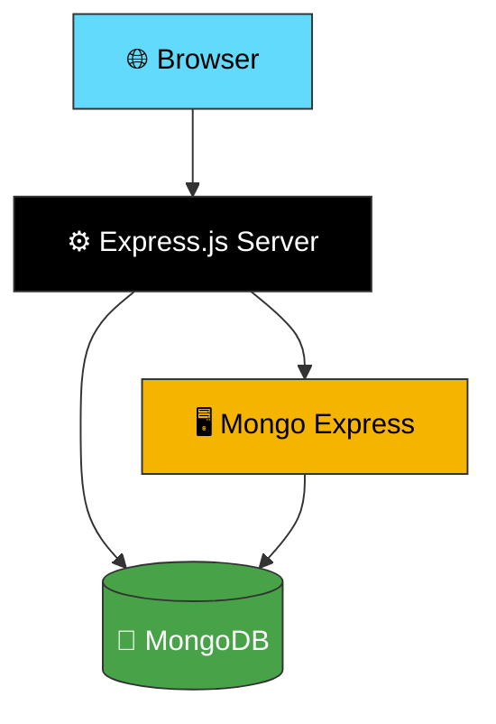
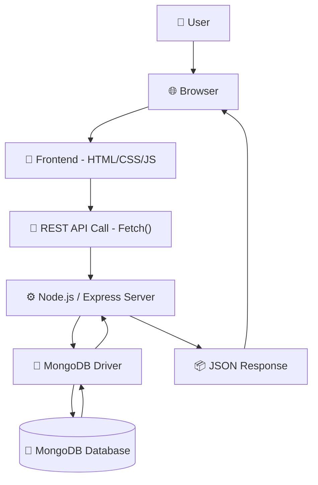
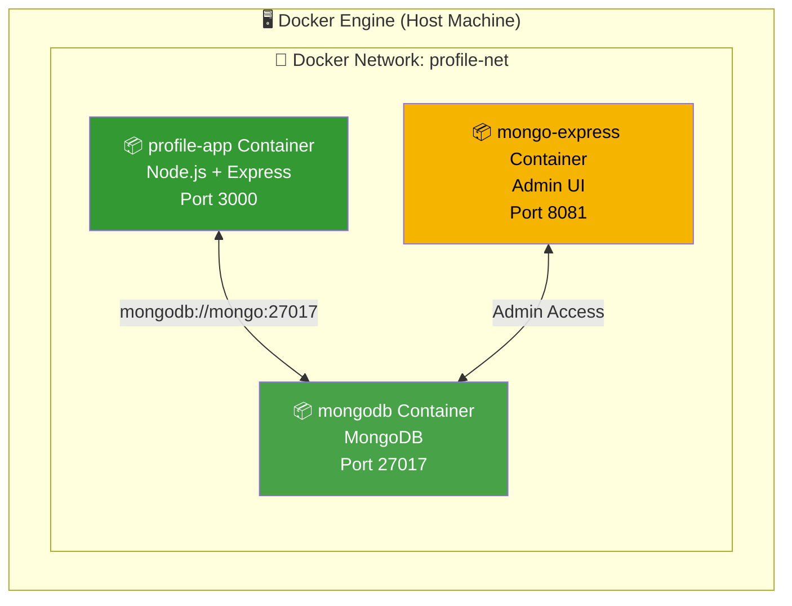
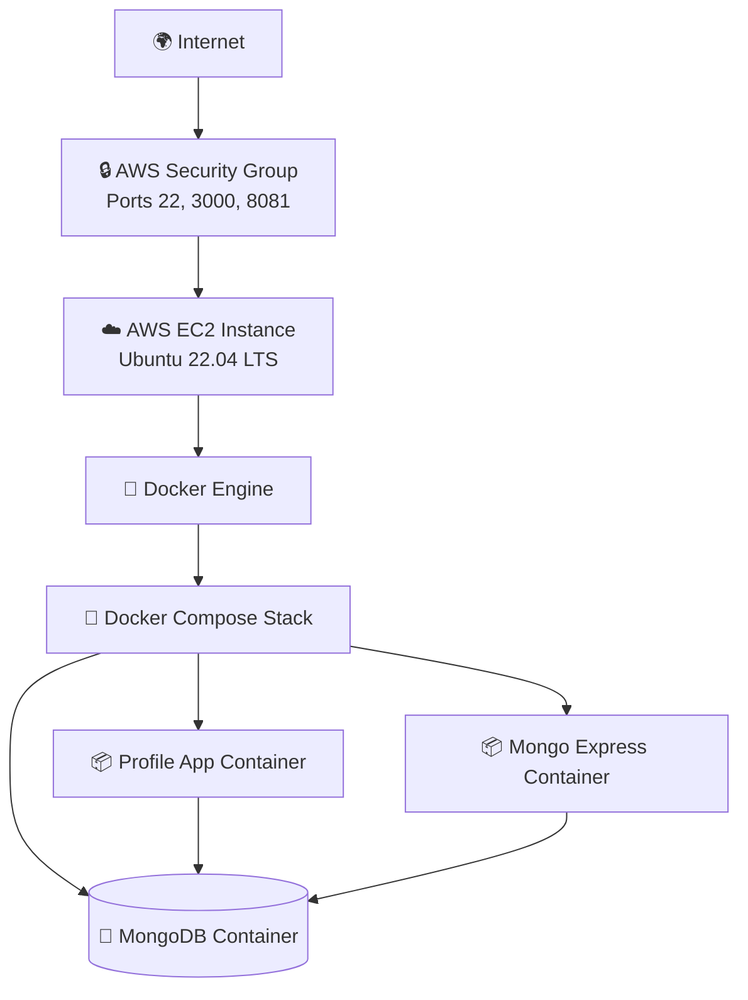

<div align="center">

# 🚀 Profile App — Dockerized CRUD User Management System

### A Full-Stack, Containerized User Management Platform built with Node.js, Express, MongoDB & Docker — Deployed on AWS EC2

[](https://nodejs.org/)
[](https://expressjs.com/)
[](https://www.mongodb.com/)
[](https://www.docker.com/)
[](https://aws.amazon.com/ec2/)
[](LICENSE)

[](https://github.com/prachipatil/profile-app/stargazers)
[](https://github.com/prachipatil/profile-app/network/members)
[](https://github.com/prachipatil/profile-app/issues)

</div>

---

## 📌 Table of Contents

- [Project Overview](#-project-overview)
- [Features](#-features)
- [Technology Stack](#-technology-stack)
- [System Architecture](#-system-architecture)
- [Application Workflow](#-application-workflow)
- [Docker Architecture](#-docker-architecture)
- [AWS Deployment Architecture](#-aws-deployment-architecture)
- [Folder Structure](#-folder-structure)
- [Installation](#-installation-local-development)
- [Docker Deployment](#-docker-deployment)
- [AWS EC2 Deployment](#-aws-ec2-deployment)
- [Environment Variables](#-environment-variables)
- [REST API Documentation](#-rest-api-documentation)
- [Screenshots](#-screenshots)
- [Useful Docker Commands](#-useful-docker-commands)
- [Troubleshooting](#-troubleshooting)
- [Learning Outcomes](#-learning-outcomes)
- [Future Improvements](#-future-improvements)
- [Author](#-author)
- [License](#-license)

---

## 📖 Project Overview

**Profile App** is a complete **Full-Stack CRUD User Management System** that demonstrates end-to-end software engineering — from frontend UI design to backend API development, database persistence, containerization, and cloud deployment.

The application allows users to **create, read, update, search, and delete** user profiles through a clean, responsive web interface. It was built to simulate a real-world production workflow: a browser-based client talks to a REST API, which in turn persists data in a NoSQL database, all wrapped inside Docker containers and shipped to the cloud.

> 💡 **Why this project matters:** It's a compact but realistic showcase of the same architectural pattern used by countless production systems — a decoupled frontend, a stateless REST backend, a document database, and container-based infrastructure.

### Why Docker?

Docker was chosen to eliminate the "it works on my machine" problem. By packaging the Node.js application, its dependencies, and configuration into a portable image, the app runs identically on a local laptop, a teammate's machine, or an AWS EC2 instance. **Docker Compose** further simplifies orchestration by spinning up the app, database, and admin UI (Mongo Express) together with a single command, connected over an isolated Docker network.

### Why MongoDB?

MongoDB was selected because user profile data is naturally **document-shaped** (flexible fields, nested attributes, no rigid schema requirements). The official **MongoDB Node.js Driver** allows direct, high-performance communication with the database without the overhead of an additional ODM layer, which is ideal for a lean CRUD service.

### Why AWS EC2?

AWS EC2 was used to demonstrate real cloud deployment skills — provisioning a virtual machine, configuring security groups, installing Docker on a fresh Ubuntu server, and running the containerized stack in a production-like environment accessible over the public internet.

---

## ✨ Features

| Icon | Feature | Description |
|:---:|---|---|
| ➕ | **Create User** | Add new user profiles via a validated form |
| 📋 | **View Users** | List all users in a responsive table/grid |
| ✏️ | **Update User** | Edit existing user details in real time |
| ❌ | **Delete User** | Remove a user profile permanently |
| 🔍 | **Search Users** | Search/filter users by name or attributes |
| 📱 | **Responsive UI** | Fully responsive across desktop, tablet, and mobile |
| ✅ | **Client-side Validation** | Instant form feedback using JavaScript |
| 🛡️ | **Server-side Validation** | Backend request validation for data integrity |
| 🔗 | **REST APIs** | Clean, resource-based Express.js API endpoints |
| 💾 | **MongoDB Persistence** | Durable data storage using MongoDB |
| 🐳 | **Dockerized App** | Fully containerized backend and dependencies |
| 🧩 | **Docker Compose** | Multi-container orchestration with one command |
| 🖥️ | **Mongo Express** | Web-based MongoDB admin GUI |
| ☁️ | **AWS EC2 Deployment** | Live deployment on a cloud Ubuntu server |

---

## 🛠️ Technology Stack

| Technology | Purpose | Version (Latest Stable) |
|---|---|---|
| **HTML5** | Markup structure for the frontend UI | Living Standard |
| **CSS3** | Styling and responsive layout | Living Standard |
| **JavaScript (ES6+)** | Client-side logic, Fetch API calls | ES2023 |
| **Node.js** | JavaScript runtime for the backend server | 18.x LTS |
| **Express.js** | Minimalist REST API framework | 4.x |
| **MongoDB** | NoSQL document database | 7.x |
| **MongoDB Node.js Driver** | Native driver for DB communication | 6.x |
| **Docker** | Application containerization | 24.x |
| **Docker Compose** | Multi-container orchestration | v2 (Compose Spec) |
| **Mongo Express** | Web-based MongoDB admin interface | 1.x |
| **AWS EC2** | Cloud virtual machine hosting | N/A |
| **Ubuntu Linux** | Server operating system | 22.04 LTS |
| **Git / GitHub** | Version control & source hosting | Latest |

---

## 🏗️ System Architecture



> 📝 **Note:** The Browser communicates only with Express.js via REST APIs. Express is the single point of contact with MongoDB, ensuring a clean separation of concerns. Mongo Express connects independently to MongoDB purely for administrative purposes.

---

## 🔄 Application Workflow



**Flow explanation:**
1. The **user** interacts with the UI in the **browser**.
2. The **frontend** (vanilla JS) captures the action and issues a `fetch()` call.
3. The **REST API request** hits the appropriate Express route.
4. **Express** processes the request and validates input.
5. The **MongoDB Driver** executes the corresponding database operation.
6. **MongoDB** returns the result, which flows back up as a JSON **response** to the browser.

---

## 🐳 Docker Architecture



> ⚠️ **Note:** All three containers communicate over a shared user-defined Docker network (`profile-net`), allowing them to resolve each other by container name instead of hardcoded IP addresses.

---

## ☁️ AWS Deployment Architecture



---

## 📁 Folder Structure

```
03-Profile-App/
├── public/
│   ├── index.html          # Main HTML page (UI structure)
│   ├── style.css            # Styling and responsive layout
│   ├── script.js             # Frontend logic (Fetch API calls)
│   └── img.jpg               # Static image asset
├── screenshots/               # App & deployment screenshots
├── server.js                   # Express server & API routes
├── Dockerfile                   # Instructions to build the app image
├── docker-compose.yml             # Multi-container orchestration config
├── package.json                    # Project metadata & dependencies
├── package-lock.json                # Locked dependency versions
├── .env                               # Environment variables (not committed)
├── README.md                          # Project documentation (this file)
├── commands.md                         # Quick-reference command notes
└── notes.md                             # Development notes
```

### 🔑 Key File Descriptions

| File | Description |
|---|---|
| `server.js` | Entry point of the backend — defines Express routes and connects to MongoDB |
| `Dockerfile` | Defines how the Node.js app image is built |
| `docker-compose.yml` | Orchestrates the app, MongoDB, and Mongo Express containers |
| `public/script.js` | Handles all client-side API calls and DOM manipulation |
| `.env` | Stores sensitive configuration like DB URI and credentials |

---

## 💻 Installation (Local Development)

### Prerequisites
- Node.js (v18+)
- MongoDB installed locally, **or** a MongoDB Atlas URI

### Steps

```bash
# 1. Clone the repository
git clone https://github.com/prachipatil/profile-app.git
cd profile-app/03-Profile-App

# 2. Install dependencies
npm install

# 3. Configure environment variables
cp .env.example .env
# then edit .env with your MongoDB URI and PORT

# 4. Start the application
npm start
```

The app will be available at **`http://localhost:3000`**.

---

## 🐳 Docker Deployment

### Key Concepts

| Concept | Description |
|---|---|
| **Dockerfile** | Blueprint that defines how the app's Docker image is built (base image, dependencies, entry point) |
| **Docker Image** | A packaged, immutable snapshot of the app built from the Dockerfile |
| **Docker Container** | A running instance of the Docker image |
| **Docker Compose** | A tool to define and run multi-container Docker applications via a single YAML file |

### Build & Run

```bash
# Build the Docker image
docker build -t profile-app:latest .

# Start all services (app + MongoDB + Mongo Express)
docker compose up -d

# View running containers
docker ps

# List all local Docker images
docker images

# View logs of a specific container
docker logs profile-app -f

# Stop and remove all containers
docker compose down
```

---

## ☁️ AWS EC2 Deployment

### Step 1 — Launch an EC2 Instance
Launch an **Ubuntu 22.04 LTS** instance (t2.micro or higher) via the AWS Console.

### Step 2 — Connect via SSH

```bash
ssh -i "your-key.pem" ubuntu@<EC2_PUBLIC_IP>
```

### Step 3 — Install Docker

```bash
sudo apt update
sudo apt install -y docker.io
sudo systemctl enable docker
sudo systemctl start docker
sudo usermod -aG docker $USER
```

### Step 4 — Install Docker Compose

```bash
sudo apt install -y docker-compose-plugin
docker compose version
```

### Step 5 — Clone the Repository

```bash
git clone https://github.com/prachipatil/profile-app.git
cd profile-app/03-Profile-App
```

### Step 6 — Configure Environment Variables

```bash
nano .env
# Add MONGO_URI, PORT, ME_CONFIG_BASICAUTH_USERNAME, ME_CONFIG_BASICAUTH_PASSWORD
```

### Step 7 — Run Docker Compose

```bash
docker compose up -d
```

### Step 8 — Verify Containers

```bash
docker ps
docker compose logs -f
```

### Step 9 — Open Security Group Ports
In the EC2 console, edit the instance's **Security Group** inbound rules to allow:

| Port | Purpose |
|---|---|
| 22 | SSH access |
| 3000 | Profile App |
| 8081 | Mongo Express |

### Step 10 — Access the Application

```
http://<EC2_PUBLIC_IP>:3000        → Profile App
http://<EC2_PUBLIC_IP>:8081        → Mongo Express
```

> ✅ **Tip:** Always restrict Mongo Express access to trusted IPs only — it should never be publicly exposed without authentication in a real production environment.

---

## 🔐 Environment Variables

| Variable | Description | Example |
|---|---|---|
| `MONGO_URI` | MongoDB connection string | `mongodb://mongo:27017/profiledb` |
| `PORT` | Port the Express server listens on | `3000` |
| `ME_CONFIG_MONGODB_SERVER` | Mongo Express target DB host | `mongo` |
| `ME_CONFIG_BASICAUTH_USERNAME` | Mongo Express login username | `admin` |
| `ME_CONFIG_BASICAUTH_PASSWORD` | Mongo Express login password | `••••••••` |
| `NODE_ENV` | Application environment | `production` |

---

## 📡 REST API Documentation

| Method | Endpoint | Description | Request Body | Response |
|---|---|---|---|---|
| `GET` | `/api/users` | Fetch all users | — | `200 OK` — Array of user objects |
| `GET` | `/api/users/:id` | Fetch a single user by ID | — | `200 OK` — User object |
| `POST` | `/api/users` | Create a new user | `{ name, email, age }` | `201 Created` — Created user |
| `PUT` | `/api/users/:id` | Update an existing user | `{ name, email, age }` | `200 OK` — Updated user |
| `DELETE` | `/api/users/:id` | Delete a user by ID | — | `200 OK` — Deletion confirmation |
| `GET` | `/api/users/search?q=` | Search users by name/keyword | — | `200 OK` — Matching users array |

---

## 🖼️ Screenshots

> 📷 Replace the placeholders below with actual screenshots stored in the `screenshots/` folder.

| View | Preview |
|---|---|
| Dashboard | `screenshots/dashboard.png` |
| Add User | `screenshots/add-user.png` |
| Edit User | `screenshots/edit-user.png` |
| Delete User | `screenshots/delete-user.png` |
| Search Users | `screenshots/search-users.png` |
| Docker Containers Running | `screenshots/docker-ps.png` |
| Docker Images | `screenshots/docker-images.png` |
| Mongo Express UI | `screenshots/mongo-express.png` |
| AWS EC2 Instance | `screenshots/aws-ec2.png` |
| Docker Compose Running | `screenshots/docker-compose-up.png` |

---

## 🧰 Useful Docker Commands

| Command | Description |
|---|---|
| `docker build -t <name> .` | Build an image from the Dockerfile |
| `docker compose up -d` | Start all services in detached mode |
| `docker compose down` | Stop and remove all containers/networks |
| `docker ps` | List running containers |
| `docker ps -a` | List all containers (including stopped) |
| `docker images` | List local Docker images |
| `docker logs <container>` | View logs of a specific container |
| `docker exec -it <container> bash` | Open an interactive shell in a container |
| `docker network ls` | List Docker networks |
| `docker volume ls` | List Docker volumes |
| `docker system prune -a` | Remove unused images/containers/networks |

---

## 🩺 Troubleshooting

<details>
<summary><strong>MongoDB Connection Refused</strong></summary>

- Ensure the `MONGO_URI` in `.env` uses the **container name** (`mongo`) rather than `localhost` when running inside Docker Compose.
- Confirm the MongoDB container is healthy: `docker ps` and `docker logs mongo`.
</details>

<details>
<summary><strong>Port Already in Use</strong></summary>

- Run `sudo lsof -i :3000` (or the relevant port) to identify the conflicting process.
- Either stop that process or change the `PORT` value in `.env` and `docker-compose.yml`.
</details>

<details>
<summary><strong>Container Exits Immediately</strong></summary>

- Check logs with `docker logs <container_name>` to identify the crash reason.
- Common causes: missing environment variables, syntax errors in `server.js`, or a missing `node_modules` due to `.dockerignore` misconfiguration.
</details>

<details>
<summary><strong>Docker Compose Fails to Start</strong></summary>

- Validate YAML syntax with `docker compose config`.
- Ensure no other process is bound to the same ports.
- Try a clean rebuild: `docker compose down -v && docker compose up --build`.
</details>

> 📝 **Note:** If issues persist, this is a sensitive area to debug carefully — take it step by step rather than changing multiple things at once, since compounding fixes often obscure the real root cause.

---

## 🎓 Learning Outcomes

**Backend Development**
- Building RESTful APIs with Express.js
- Implementing CRUD operations and request validation

**Database**
- Working with MongoDB using the native Node.js driver
- Designing document-oriented data models

**Docker**
- Writing Dockerfiles and multi-stage builds
- Orchestrating multi-container apps with Docker Compose
- Understanding Docker networking between services

**AWS**
- Provisioning and configuring EC2 instances
- Managing Security Groups and inbound/outbound rules

**Linux**
- Server administration on Ubuntu
- Package management and process/port debugging

**Cloud & DevOps**
- End-to-end deployment pipeline from local dev to cloud production
- Environment-based configuration management

---

## 🔮 Future Improvements

- [ ] User Authentication
- [ ] JWT-based Authorization
- [ ] Role-Based Access Control (RBAC)
- [ ] Profile Image Uploads
- [ ] Docker Volumes for persistent MongoDB storage
- [ ] Nginx as a Reverse Proxy
- [ ] HTTPS via Let's Encrypt/SSL
- [ ] CI/CD Pipeline
- [ ] GitHub Actions for automated build/test/deploy
- [ ] Amazon ECR for image storage
- [ ] Infrastructure as Code with Terraform
- [ ] Kubernetes Orchestration
- [ ] Helm Charts for K8s deployment
- [ ] Monitoring with Grafana
- [ ] Metrics with Prometheus
- [ ] Migration to AWS ECS
- [ ] Migration to AWS EKS
- [ ] Load Balancer Integration
- [ ] Auto Scaling Groups

---

## 👩‍💻 Author

**Prachi Patil**

[](https://github.com/prachipatil)
[](https://linkedin.com/in/prachipatil)
[](https://prachipatil.dev)

---

## 📄 License

This project is licensed under the **MIT License** — see the [LICENSE](LICENSE) file for details.

---

<div align="center">

### ⭐ If you found this project useful, consider giving it a star!

</div>
